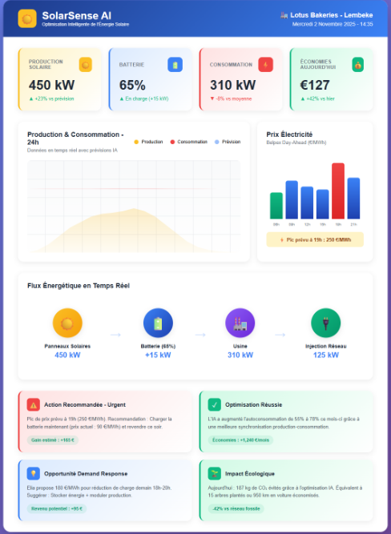
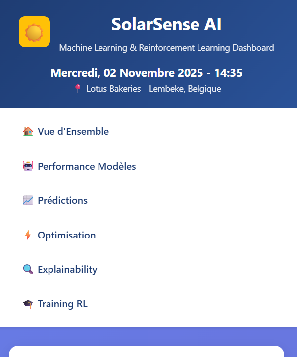
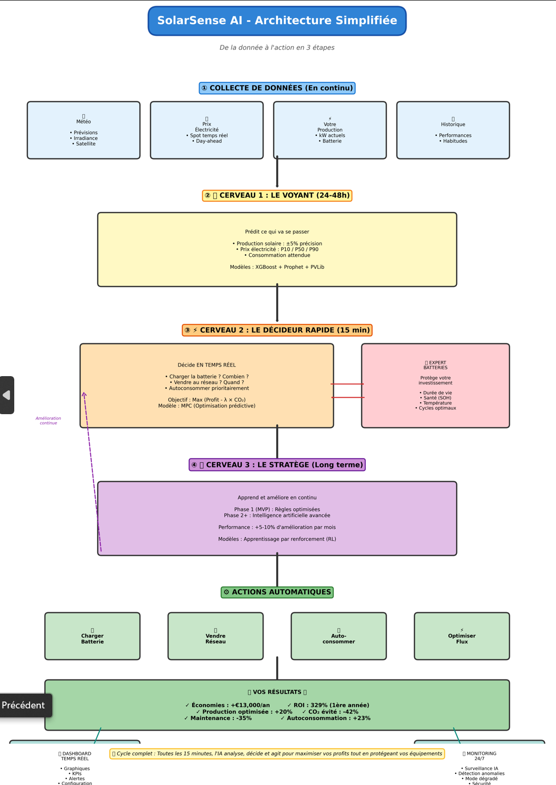
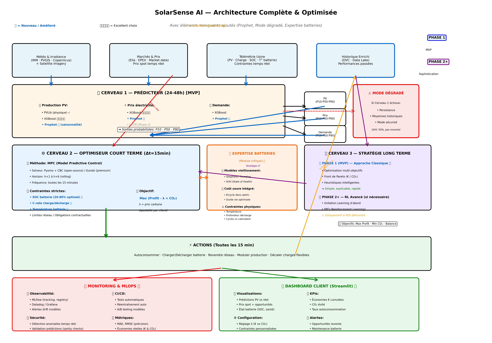

# 📊 SolarSense AI - Dashboard Frontend

> **Optimisation Intelligente de l'Énergie Solaire**  
> Frontend moderne pour la gestion et monitoring en temps réel de production solaire



---

## 🎯 Vue d'Ensemble

**SolarSense AI** est une plateforme de gestion énergétique intelligente qui optimise la production, le stockage et la consommation d'énergie solaire en temps réel. Ce repository contient le **frontend** développé avec une approche **DevOps-first**.

### ✨ Points Clés
- 📈 **Monitoring temps réel** de la production et consommation
- 🔋 **Gestion intelligente** du stockage batterie
- 💰 **Optimisation économique** basée sur les tarifs dynamiques
- 🌍 **Impact écologique** avec métriques CO₂
- 🚨 **Alertes prédictives** et recommandations IA

---

## 📸 Interface & Visualisations

### Dashboard Principal - Vue d'Ensemble

*Monitoring temps réel : Production (450 kW), Batterie (65%), Consommation (310 kW), Économies (€127)*

### Navigation & Modèles ML/RL

*Accès aux différents modules : Performance, Prédictions, Optimisation, Training RL, Explainability*

---

## 🏗️ Architecture du Système

### Architecture Simplifiée - Vue Marketing


**De la donnée à l'action en 3 étapes :**
1. **🔵 Cerveau 1 - Le Voyant (24-48h)** : Prédictions de production solaire, prix électricité, consommation
2. **🟠 Cerveau 2 - Le Décideur (15 min)** : Optimisation temps réel (charger batterie, vendre au réseau, autoconsommer)
3. **🟣 Cerveau 3 - Le Stratège (Long terme)** : Apprentissage continu par renforcement (RL)

**Résultats :** Économies +€13k/an • Production optimisée +20% • Maintenance -35% • ROI 329% • CO₂ évité -42%

### Architecture Détaillée - Vue Technique


**Stack Complet :**
- **Phase 1 (MVP)** : Modèles prédictifs (XGBoost, Prophet, PVLib)
- **Phase 2+** : Renforcement Learning avancé (MPC, Pyomo, Gurobi)
- **Expertise Batteries** : Optimisation durée de vie, cycles, SOH
- **Monitoring & MLOps** : Observabilité complète, CI/CD, tests automatiques

---

## 📊 KPIs & Métriques Principales

| KPI | Description | Utilité Business |
|-----|-------------|------------------|
| **Production Solaire** | Puissance instantanée générée (kW) | Suivi de la performance des panneaux |
| **Batterie** | Niveau de charge (%) + flux charge/décharge | Optimisation du stockage énergétique |
| **Consommation** | Puissance consommée en temps réel (kW) | Détection des pics et optimisation |
| **Économies** | Gain financier journalier (€) | ROI et rentabilité du système |
| **Prix Électricité** | Tarif horaire du réseau (€/kWh) | Stratégie d'injection/achat réseau |
| **Injection Réseau** | Surplus revendu au réseau (kW) | Revenus complémentaires |
| **Impact Écologique** | CO₂ évité, équivalent arbres plantés | Communication RSE |

### 📈 Métriques Affichées dans le Dashboard

#### **Cartes KPI (Top)**
- 🌞 **Production Solaire** : 450 kW (+25% vs période précédente)
- 🔋 **Batterie** : 65% (+5% charge en 15 min)
- 🏠 **Consommation** : 310 kW (-8% vs semaine dernière)
- 💶 **Économies Aujourd'hui** : €127 (+25% vs hier)

#### **Flux Énergétique Temps Réel (Centre)**
Visualisation circulaire des flux instantanés :
- ☀️ **Panneaux → 450 kW** (source)
- 🔋 **Batterie → +15 kW** (charge en cours)
- 🏠 **Maison → 310 kW** (consommation)
- ⚡ **Injection Réseau → 125 kW** (surplus)

#### **Alertes & Recommandations IA (Bas)**
- 🔴 **Action Recommandée - Urgent** : Recharger batterie avant pic tarifaire (18h-20h)
- 🔵 **Opportunité Demand Response** : Délestage programmé pendant charge élevée (18h-20h)
- 🟢 **Optimisation Réussie** : Synchronisation production-consommation (+18% de meilleur flux)
- 🌱 **Impact Écologique** : 19 kg CO₂ évités → équivalent 9 arbres plantés aujourd'hui

---

## 🏗️ Flux de Données Simplifié

```
┌──────────────────────────────────────────────────────────────────┐
│                     SOLARSENSE AI PLATFORM                       │
└──────────────────────────────────────────────────────────────────┘

1. 📡 Capteurs IoT (Panneaux, Batterie, Compteurs)
         ↓
2. 🔧 MQTT Broker + Backend (Python/FastAPI)
         ↓
3. 🤖 AI Engine (Prédictions + Optimisation MPC)
         ↓
4. 📊 WebSocket (Temps Réel) → Frontend React
         ↓
5. 🖥️ Dashboard affiche visuels + alertes en <500ms
```

**Latence cible** : <500ms du capteur à l'affichage

---

## 🛠️ Stack Technique

### **Frontend**
```yaml
Framework: React 18 + TypeScript
UI/UX: TailwindCSS + Headless UI + Framer Motion
Visualisation: Chart.js + D3.js + Recharts
Temps Réel: Socket.io Client + React Query
State Management: Zustand / Redux Toolkit
Build: Vite (HMR ultra-rapide)
```

### **DevOps & Infrastructure**
```yaml
CI/CD:
  - GitHub Actions (tests + deploy automatique)
  - Docker multi-stage builds
  - Nginx reverse proxy

Monitoring:
  - Prometheus + Grafana (métriques frontend)
  - Sentry (error tracking)
  - Lighthouse CI (performance)

Déploiement:
  - AWS S3 + CloudFront / Vercel
  - Auto-scaling basé sur le trafic
  - Blue-Green deployment

Tests:
  - Jest + React Testing Library (unit tests)
  - Cypress (e2e tests)
  - Storybook (composants UI)
```

---

## 🚀 Installation & Démarrage

### **Prérequis**
```bash
Node.js >= 18.x
npm >= 9.x ou yarn >= 1.22
Docker (optionnel)
```

### **Installation Locale**
```bash
# Cloner le repo
git clone https://github.com/flow3flow/solarsense_front.git
cd solarsense_front

# Installer les dépendances
npm install

# Configurer les variables d'environnement
cp .env.example .env
# Éditer .env avec l'URL de ton backend

# Lancer en développement
npm run dev

# Ouvrir http://localhost:3000
```

### **Avec Docker** 🐳
```bash
# Build l'image
docker build -t solarsense-front:latest .

# Run le container
docker run -p 3000:80 solarsense-front:latest

# Ou avec docker-compose (stack complète)
docker-compose up -d

# Frontend accessible sur http://localhost:3000
```

---

## 🧪 Tests & Qualité

```bash
# Tests unitaires
npm run test

# Tests avec coverage
npm run test:coverage

# Tests e2e (Cypress)
npm run test:e2e

# Linter + formatter
npm run lint
npm run format

# Audit de sécurité
npm audit

# Build de production
npm run build
```

### **Métriques de Qualité Cibles**
- ✅ Code coverage > 80%
- ✅ Lighthouse score > 90 (Performance, Accessibility, Best Practices, SEO)
- ✅ Zero vulnérabilités critiques
- ✅ Build time < 2 min
- ✅ Bundle size < 500 KB (gzipped)

---

## 📁 Structure du Projet

```
solarsense_front/
├── src/
│   ├── components/
│   │   ├── Dashboard/
│   │   │   ├── DashboardLayout.tsx
│   │   │   ├── KPICard.tsx
│   │   │   ├── EnergyFlowViz.tsx
│   │   │   └── AlertPanel.tsx
│   │   ├── Charts/
│   │   │   ├── ProductionChart.tsx
│   │   │   └── PriceChart.tsx
│   │   └── shared/
│   │       ├── Button.tsx
│   │       └── Card.tsx
│   ├── services/
│   │   ├── api.ts (REST calls)
│   │   └── websocket.ts (temps réel)
│   ├── hooks/
│   │   ├── useSolarData.ts
│   │   └── useWebSocket.ts
│   ├── stores/
│   │   └── dashboardStore.ts
│   ├── utils/
│   │   ├── formatters.ts
│   │   └── validators.ts
│   ├── types/
│   │   └── dashboard.types.ts
│   └── App.tsx
├── public/
│   └── assets/
│       ├── dashboard.png
│       ├── solarsense-dashboard-navigation.png
│       ├── solarsense-architecture-simplified.png
│       └── solarsense-architecture-detailed.png
├── tests/
│   ├── unit/
│   └── e2e/
├── .github/
│   └── workflows/
│       ├── ci.yml
│       └── deploy.yml
├── Dockerfile
├── docker-compose.yml
├── nginx.conf
├── .env.example
└── README.md
```

---

## 🔐 Sécurité & Bonnes Pratiques

### **Sécurité**
- ✅ **Aucun secret** dans le code (variables d'environnement uniquement)
- ✅ **CSP headers** configurés (Content Security Policy)
- ✅ **HTTPS obligatoire** en production
- ✅ **Rate limiting** sur les API calls
- ✅ **Input sanitization** sur tous les formulaires
- ✅ **XSS protection** (échappement automatique React)
- ✅ **CORS** configuré strictement

### **Performance**
- ✅ **Code splitting** (lazy loading des routes)
- ✅ **Image optimization** (WebP + lazy loading)
- ✅ **Caching strategy** (Service Worker)
- ✅ **Bundle analysis** (Webpack Bundle Analyzer)

---

## 🌐 Déploiement

### **Environnements**
| Env | URL | Branch | Auto-deploy |
|-----|-----|--------|-------------|
| 🟢 **Production** | https://solarsense.ai | `main` | ✅ |
| 🟡 **Staging** | https://staging.solarsense.ai | `develop` | ✅ |
| 🔵 **Dev** | http://localhost:3000 | `feature/*` | - |

### **Pipeline CI/CD**
```yaml
1. Push code → GitHub
2. GitHub Actions trigger:
   - Lint & Format check
   - Unit tests
   - Build production
   - e2e tests (Cypress)
   - Security scan (npm audit)
3. Si tous les tests passent → Deploy automatique
4. Healthcheck + Smoke tests
5. Notification Slack
```

### **Deploy Manuel (si besoin)**
```bash
# Build optimisé
npm run build

# Preview du build
npm run preview

# Deploy sur Vercel
vercel --prod

# Ou deploy sur AWS S3
aws s3 sync dist/ s3://solarsense-front --delete
aws cloudfront create-invalidation --distribution-id XXXXX --paths "/*"
```

---

## 📈 Roadmap

### ✅ Phase 1 - MVP (Complété)
- [x] Dashboard temps réel avec KPIs
- [x] Visualisation flux énergétiques
- [x] Alertes et recommandations
- [x] Responsive design (mobile-first)
- [x] CI/CD avec GitHub Actions
- [x] Docker containerization

### 🚧 Phase 2 - Avancée (En cours)
- [ ] Authentification & autorisation (JWT)
- [ ] Multi-utilisateurs (rôles: Admin, User, Guest)
- [ ] Historique et comparaison de périodes
- [ ] Export de rapports (PDF/Excel)
- [ ] Notifications push (Web Push API)
- [ ] Dark mode / Light mode

### 🔮 Phase 3 - Évolution (Q2 2025)
- [ ] Application mobile (React Native)
- [ ] Prédictions personnalisables par l'utilisateur
- [ ] Intégration avec assistants vocaux (Alexa, Google)
- [ ] Marketplace de stratégies d'optimisation
- [ ] API publique pour développeurs tiers

### 🚀 DevOps & Infra
- [x] Monitoring Prometheus/Grafana
- [ ] Kubernetes deployment (Helm charts)
- [ ] Terraform IaC pour l'infra AWS
- [ ] Feature flags (LaunchDarkly)
- [ ] A/B testing automatisé (Optimizely)
- [ ] Disaster Recovery Plan

---

## 🤝 Contribution

Les contributions sont les bienvenues ! 🎉

### **Comment contribuer ?**
1. **Fork** le projet
2. Créer une branche feature (`git checkout -b feature/AmazingFeature`)
3. Commit les changements (`git commit -m 'Add some AmazingFeature'`)
4. Push vers la branche (`git push origin feature/AmazingFeature`)
5. Ouvrir une **Pull Request**

### **Guidelines**
- ✅ Respecter les conventions de code (ESLint + Prettier)
- ✅ Ajouter des tests pour les nouvelles features
- ✅ Mettre à jour la documentation si nécessaire
- ✅ Faire des commits atomiques et descriptifs
- ✅ Suivre le format de commit : `type(scope): message` (Conventional Commits)

### **Code Review**
Toutes les PRs doivent être reviewées par au moins 1 mainteneur avant le merge.

---

## 🐛 Bug Report & Feature Request

### **Signaler un bug**
Utiliser les [GitHub Issues](https://github.com/flow3flow/solarsense_front/issues) avec le template "Bug Report"

### **Proposer une feature**
Utiliser les [GitHub Issues](https://github.com/flow3flow/solarsense_front/issues) avec le template "Feature Request"

---

## 📝 License

Ce projet est sous licence **MIT** - voir le fichier [LICENSE](LICENSE) pour plus de détails.

---

## 📞 Contact & Support

**DevOps Engineer & Full-Stack Developer**  
**Florence Jaymes**

- 📧 **Email** : florence.jaymes@gmail.com
- 🔗 **LinkedIn** : [florence-jaymes](https://www.linkedin.com/in/florence-jaymes)
- 🐙 **GitHub** : [@flow3flow](https://github.com/flow3flow)
- 💼 **Portfolio** : [En construction]

---

## 🙏 Remerciements

Merci à tous les contributeurs qui ont aidé à faire de SolarSense AI une réalité :
- L'équipe Anthropic pour Claude AI
- La communauté open-source React
- Les experts en énergie solaire pour leurs conseils

---

## 📊 Statistiques du Projet


---

<div align="center">

**⚡ Fait avec passion pour l'énergie verte et le DevOps 🌱**

*"Optimiser l'énergie solaire, une prédiction à la fois"*

[⬆ Retour en haut](#-solarsense-ai---dashboard-frontend)

</div>